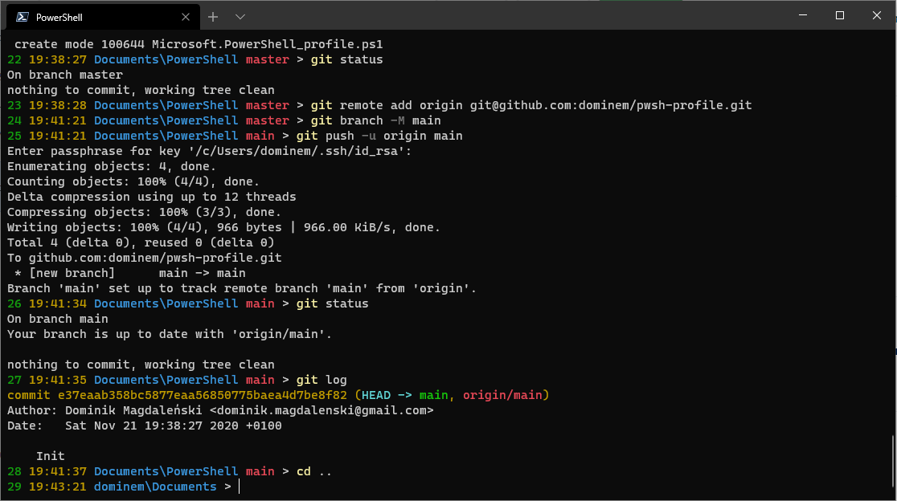
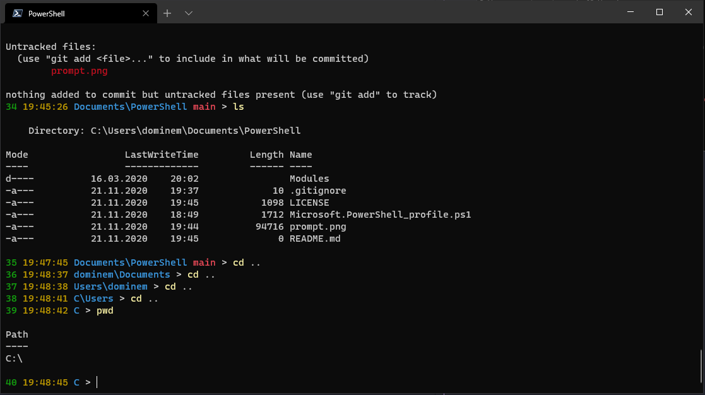

# dominem/pwsh-profile

My PowerShell profile with customized command line prompt.

Looks good in [Windows Terminal](https://en.wikipedia.org/wiki/Windows_Terminal) with PowerShell 7.




Custom prompt installation:
1. Check your `$PROFILE` path:
   ```
   50 19:56:44 Users\dominem > echo $PROFILE
   C:\Users\dominem\Documents\PowerShell\Microsoft.PowerShell_profile.ps1
   ```
2. Copy the `function global:prompt {...}` definition from `Microsoft.PowerShell_profile.ps1` file to your `$PROFILE` file.
3. Run `. $PROFILE` to refresh the PowerShell profile or just restart your terminal(s).
